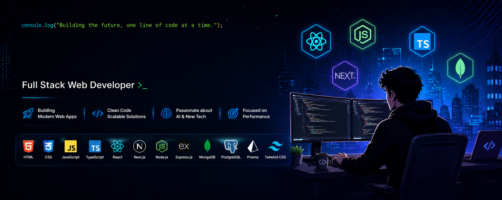

<!-- Banner -->

  

<h1 align="center">Hi 👋, I'm Tanzid Un Khalil</h1>

  

---

## 🚀 About Me

- 👋 Hi, I'm **[@tanzid109](https://github.com/tanzid109)**
- 💼 Full Stack Web Developer with **1+ year of professional experience**
- 🌱 Currently improving my skills in **TypeScript, Prisma, PostgreSQL & NestJS**
- ⚡ Building scalable applications using **Next.js, React.js, Node.js & Express.js**
- 🛠️ Experienced with **MongoDB, Firebase, Tailwind CSS, ShadCN UI & Redux Toolkit**
- 🤖 Passionate about integrating **AI APIs** into modern web applications
- 💬 Ask me about **React, Next.js, MERN Stack, REST APIs & Prisma**
- 🌐 Portfolio: **https://tanzid.vercel.app**
- 📧 Email: **tanzid.unkhalil109@gmail.com**

---

# 🌐 Connect With Me

&nbsp;

&nbsp;

&nbsp;

---

# 💻 Tech Stack

### Languages

### Frontend

### Backend

### Database

### Tools

---

# 📊 GitHub Statistics

  
  

---

# 🔥 GitHub Streak

  

---

# 📈 Contribution Graph

  

---

# 🏆 GitHub Trophies

---

# 💡 Random Dev Quote

---

---

<h3 align="center">⭐ Thanks for visiting my profile! ⭐</h3>

Feel free to check out my repositories and connect with me.

